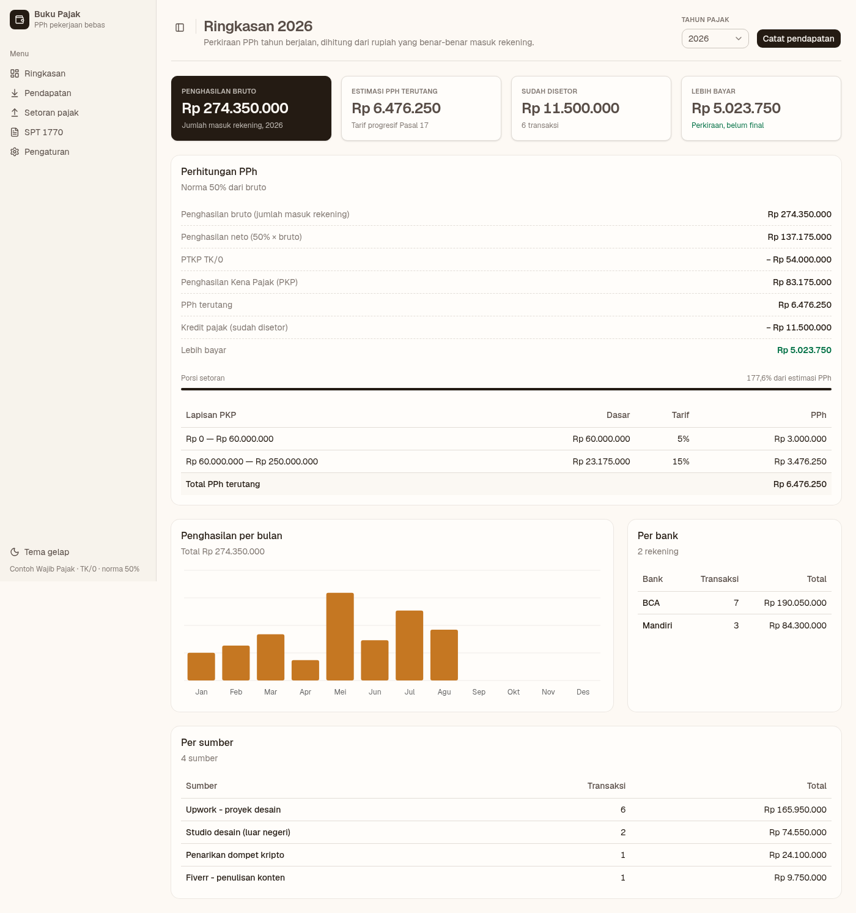
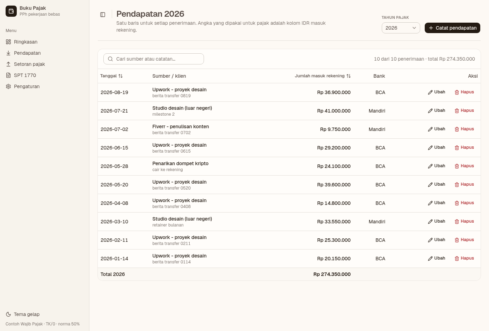
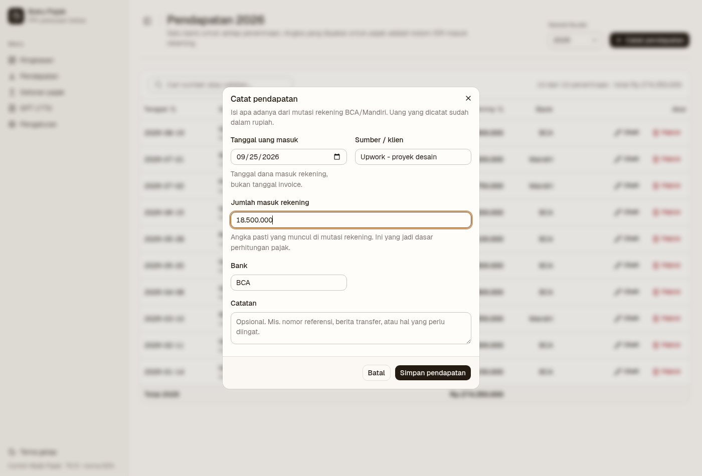
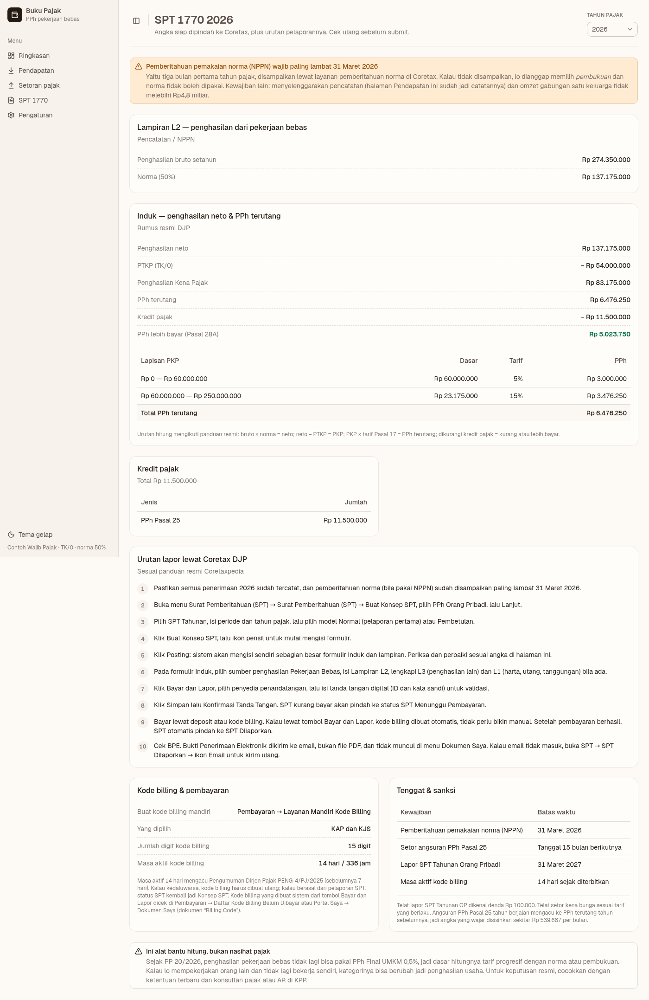
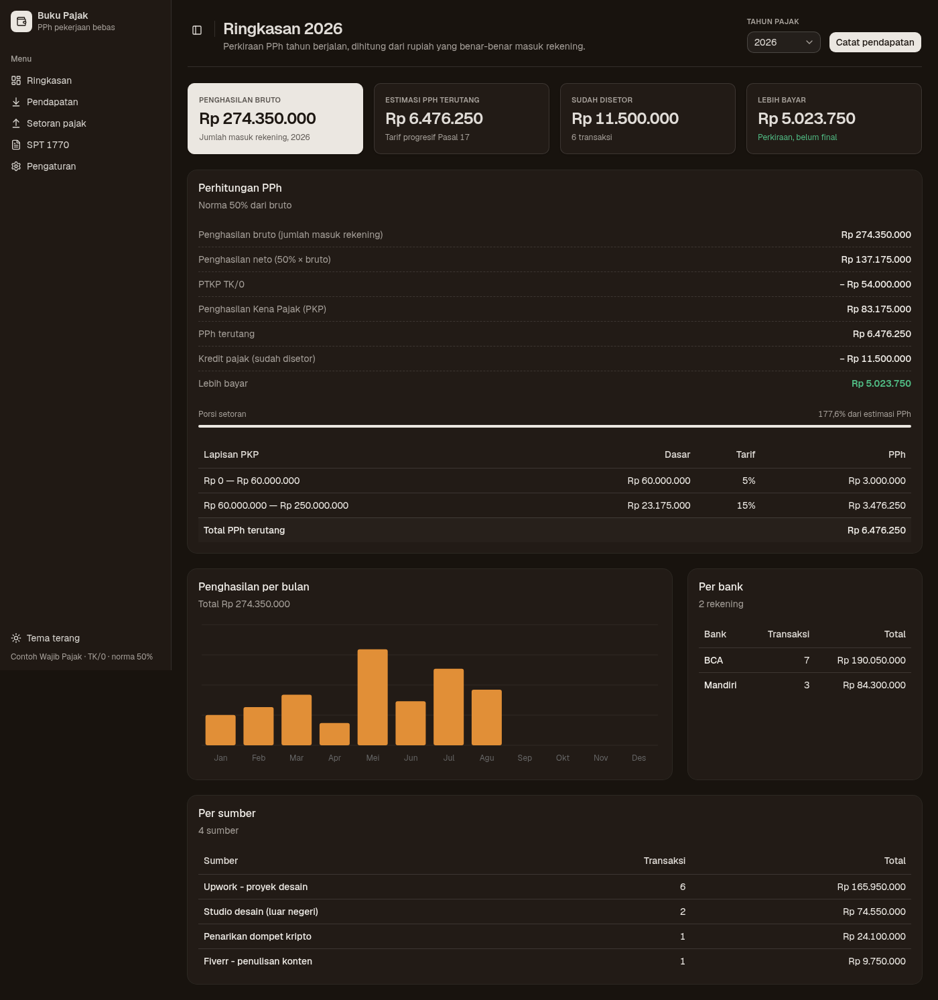

<p align="center">
  
</p>

# Buku Pajak

> Aplikasi pencatatan pajak untuk pekerjaan bebas (freelancer): mencatat mutasi rekening,
> menghitung PPh, dan menyiapkan pelaporan SPT 1770.

Aplikasi pencatatan penghasilan dan penghitungan PPh untuk **pekerjaan bebas** (freelancer).

Secara sederhana, pengguna mengunduh mutasi rekening BCA/Mandiri, kemudian mencatat setiap
penerimaan sesuai nilai yang tertera. Nilai transaksi sudah dalam mata uang rupiah, sehingga
**tidak diperlukan konversi mata uang** pada aplikasi ini: kolom nominal rupiah yang diterima
ke rekening menjadi dasar perhitungan pajak.

- Rancangan lengkap: [`docs/SYSTEM-DESIGN.md`](docs/SYSTEM-DESIGN.md)
- Token desain: [`web/src/index.css`](web/src/index.css)

## Tampilan

<p align="center">
  
  <br>
  <sub>Ringkasan: estimasi PPh setahun, rincian per lapisan tarif, grafik per bulan, rekap per bank dan per klien.</sub>
</p>

<p align="center">
  
  <br>
  <sub>Pendapatan: setiap penerimaan dari mutasi rekening, dapat dicari dan diurutkan.</sub>
</p>

<p align="center">
  
  <br>
  <sub>Pencatatan pendapatan: tanggal, klien, jumlah masuk rekening, bank.</sub>
</p>

<p align="center">
  
  <br>
  <sub>SPT 1770: angka yang siap dipindahkan ke Coretax, kewajiban NPPN, urutan pelaporan, dan tenggat waktu.</sub>
</p>

<p align="center">
  
  <br>
  <sub>Tema gelap (mengikuti preferensi sistem, dapat diganti secara manual).</sub>
</p>

## Latar Belakang

- Sejak **PP 20/2026** (efektif 22 April 2026), penghasilan dari **pekerjaan bebas tidak lagi
  diperkenankan** menggunakan PPh Final UMKM 0,5%. Dasar penghitungannya menjadi tarif
  progresif Pasal 17 melalui **norma (NPPN)** atau **pembukuan**.
- Penghasilan dari klien luar negeri tetap merupakan objek pajak Indonesia (worldwide income),
  dan klien luar negeri umumnya tidak memotong pajak sehingga wajib disetor sendiri.
- Pelaporan SPT menggunakan formulir **1770** (bukan 1770 S/SS) melalui Coretax, paling lambat
  31 Maret.
- Apabila menggunakan norma, **pemberitahuan pemakaian NPPN wajib disampaikan paling lambat
  31 Maret** (tiga bulan pertama tahun pajak) melalui layanan pemberitahuan norma di Coretax.
  Jika tidak disampaikan, wajib pajak **dianggap memilih pembukuan**. Catatan: wajib pajak
  tetap harus menyelenggarakan pencatatan (aplikasi ini merupakan salah satu bentuknya), dengan
  syarat omzet gabungan satu keluarga tidak melebihi Rp4,8 miliar.

## Arsitektur Singkat

**Monolit satu proses.** Satu perintah `uvicorn` menyajikan API dan tampilan sekaligus pada
satu port yang sama. Tidak ada proses kedua dan tidak ada CORS.

- **Tampilan**: SPA React 19 + TypeScript, shadcn/ui (Radix) + Tailwind CSS v4, TanStack Query,
  TanStack Table v9, React Hook Form + Zod, Recharts, Sonner. Tersedia tema terang dan gelap.
- **API**: FastAPI + pydantic. Engine pajak Python terpisah dari UI sehingga dapat diuji tanpa
  browser.
- **Data**: SQLite satu file di `data/pajak.db`.

## Menjalankan

Diperlukan Python 3.10+ dan Node 20+.

```bash
./run.sh
```

Skrip tersebut akan membangun frontend secara otomatis apabila belum tersedia, kemudian
menjalankan seluruh aplikasi pada <http://127.0.0.1:8000>.

```bash
PORT=9000 ./run.sh     # ganti port
./run.sh --reload      # mode pengembangan (auto-reload)
```

Apabila lebih memilih menjalankan secara manual:

```bash
cd web && npm install --include=dev && npm run build   # sekali saja
cd .. && python3 -m uvicorn app.main:app --port 8000
```

> Apabila `NODE_ENV=production` di-set secara global (seperti pada mesin ini), npm akan
> melewati `devDependencies`. Gunakan `npm install --include=dev`, jika tidak `typescript`
> tidak terpasang dan `npm run build` akan gagal.

**Memerlukan hot-reload saat mengubah tampilan?** Sebagai opsi, jalankan dev server Vite pada
terminal lain; `/api` akan otomatis diproksikan ke port 8000:

```bash
cd web && npm run dev      # buka http://localhost:5173
```

## Alur Penggunaan

1. **Pengaturan**: nama, NPWP, status PTKP, metode penghitungan, dan persentase norma (tenaga
   ahli umumnya 50%).
2. **Pendapatan**: mencatat setiap penerimaan dari mutasi rekening (tanggal uang masuk, klien,
   **jumlah yang masuk rekening**, dan bank). Kolom dapat diurutkan dan dilengkapi pencarian.
3. **Setoran pajak**: mencatat setiap pembayaran (PPh 25 bulanan, PPh 29, dll) sebagai kredit
   pajak.
4. **Ringkasan**: estimasi PPh terutang, jumlah yang sudah disetor, sisa kurang bayar, rincian
   per lapisan tarif, grafik per bulan, serta rekap per bank dan per klien.
5. **SPT 1770**: angka yang siap dipindahkan ke Coretax, urutan pelaporan resmi, kewajiban
   NPPN, dan tenggat waktu.

## Komponen Perhitungan

| Komponen | Cara |
|---|---|
| Penghasilan bruto | Total kolom jumlah masuk rekening |
| Penghasilan neto | `norma% × bruto` (NPPN) atau `bruto − biaya usaha` (pembukuan) |
| PKP | `neto − PTKP` (minimum 0) |
| PPh terutang | Tarif progresif 5% / 15% / 25% / 30% / 35% |
| Kurang bayar | `PPh terutang − total setoran` |
| Angsuran PPh 25 | `PPh terutang ÷ 12` (indikasi untuk disisihkan) |

PTKP mengikuti PMK 101/PMK.010/2016: TK/0 sebesar Rp54 juta, tambahan status kawin Rp4,5 juta,
tambahan setiap tanggungan Rp4,5 juta (maksimal 3 tanggungan), dan penghasilan istri yang
digabung (K/I) ditambah Rp54 juta.

Urutan penghitungan ini mengikuti rumus resmi pada panduan Coretaxpedia.

## Pengujian

```bash
# backend (83 tes)
python3 -m unittest discover -s tests -v

# frontend (typecheck + build produksi)
cd web && npm run build
```

## Aplikasi Desktop

Selain dijalankan lewat `./run.sh`, Buku Pajak juga bisa dibangun jadi aplikasi desktop
installable (Windows/macOS/Linux) memakai [Tauri](https://tauri.app). Arsitekturnya tetap
sama seperti mode web: backend FastAPI dibungkus jadi binary standalone (via PyInstaller)
yang berjalan sebagai *sidecar*, lalu window native Tauri diarahkan ke server lokal itu,
sehingga kode frontend maupun backend tidak berubah sama sekali.

Build lokal (Linux, butuh Rust dan `tauri-cli`):

```bash
cargo install tauri-cli --version "^2"
./scripts/build-sidecar.sh   # bangun backend jadi binary sidecar
cd src-tauri && cargo tauri build
```

> PyInstaller tidak bisa cross-compile: binary Windows harus dibangun di Windows, binary
> macOS di macOS. Build lokal di atas hanya menghasilkan installer untuk platform yang
> dipakai membangunnya. Installer untuk ketiga platform sekaligus dihasilkan otomatis lewat
> workflow CI di `.github/workflows/build-desktop.yml` (GitHub Actions, matrix
> ubuntu/windows/macos), bisa diunduh dari tab Actions tiap kali workflow itu jalan.

Data aplikasi desktop tersimpan di folder data aplikasi bawaan OS (lewat `app_data_dir()`
Tauri), terpisah dari `data/pajak.db` yang dipakai mode `./run.sh`.

## Data dan Backup

Seluruh data tersimpan lokal dalam satu file SQLite (`data/pajak.db`). Backup dilakukan dengan
menyalin file tersebut. Aplikasi ini **tidak melakukan panggilan jaringan sama sekali**: tidak
ada data yang keluar dari mesin pengguna.

Apabila database dibuat sebelum konsep konversi valas dihapus, kolom `mata_uang`,
`jumlah_valas`, dan `kurs_kmk` akan dibuang secara otomatis saat aplikasi dibuka, tanpa
menghilangkan baris data yang sudah ada.

## Batasan

- Mode **norma** dan **pembukuan** sudah didukung, tetapi kredit pajak luar negeri (PPh 24)
  masih dicatat secara manual sebagai setoran dan belum dihitung otomatis per negara.
- Belum tersedia dukungan PPN. Apabila wajib pajak dikukuhkan sebagai PKP, diperlukan modul
  terpisah.
- Belum tersedia fitur impor mutasi rekening; input data masih dilakukan satu per satu (fitur
  ini direncanakan, karena alur kerja aplikasi memang berbasis mutasi BCA/Mandiri).
- UI lama (server-rendered Jinja2) sudah **tidak digunakan lagi** pada aplikasi utama. File
  tersebut masih tersimpan di `app/legacy_ui.py`, `app/templates`, dan `app/static` agar tidak
  hilang, dan masih diuji melalui `tests/test_app.py`. Perlu dicatat bahwa UI tersebut **belum
  disesuaikan** dengan penghapusan konversi valas sehingga beberapa kolomnya tampil kosong.
  File-file ini dapat dihapus kapan saja apabila diperlukan pembersihan.
- `app/kurs.py` beserta `tests/test_kurs.py` juga tetap disimpan, tetapi sudah tidak digunakan.

## Catatan

Aplikasi ini merupakan alat bantu penghitungan, **bukan nasihat pajak**. Untuk keputusan
pelaporan resmi, sesuaikan dengan ketentuan terbaru serta konsultasikan dengan konsultan pajak
atau Account Representative (AR) di KPP terkait.
